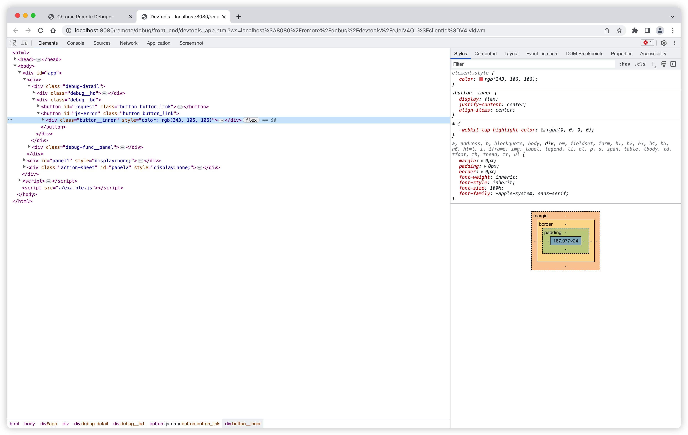
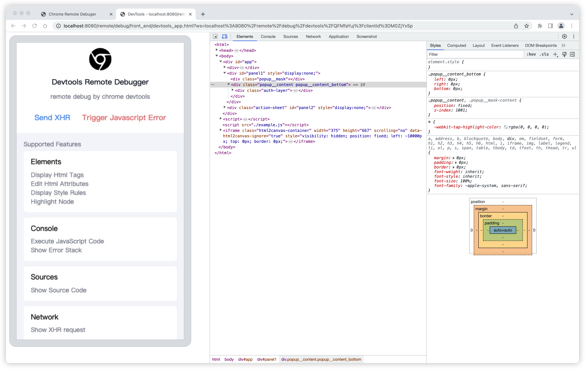
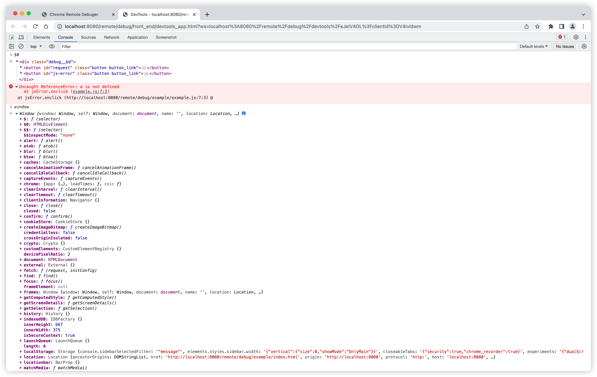
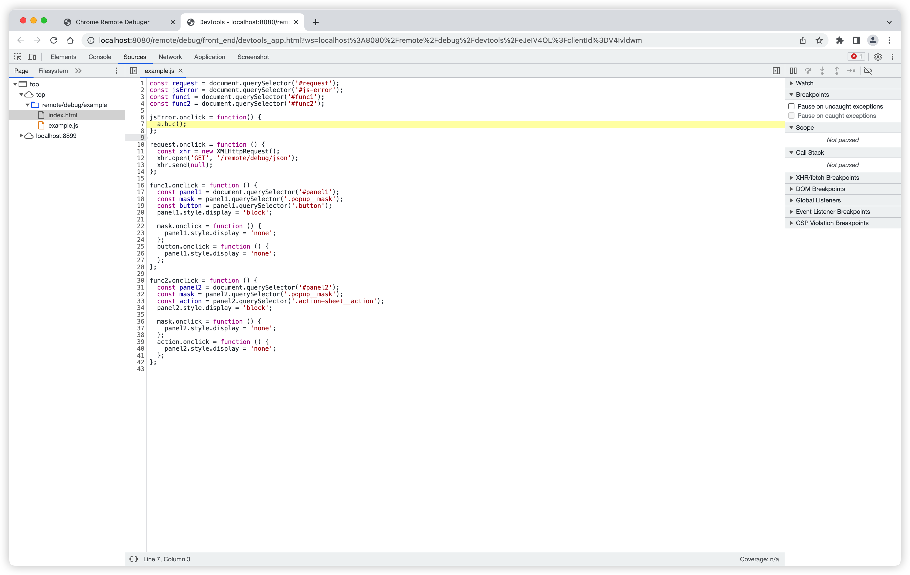
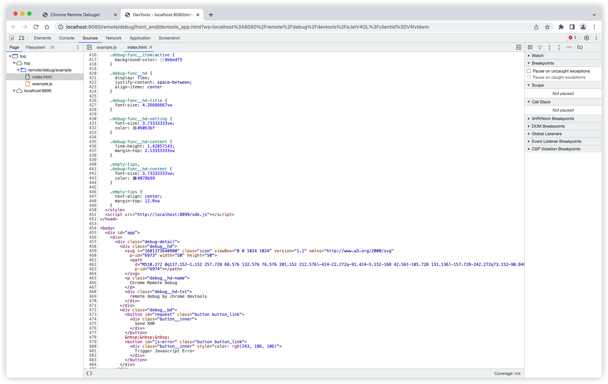
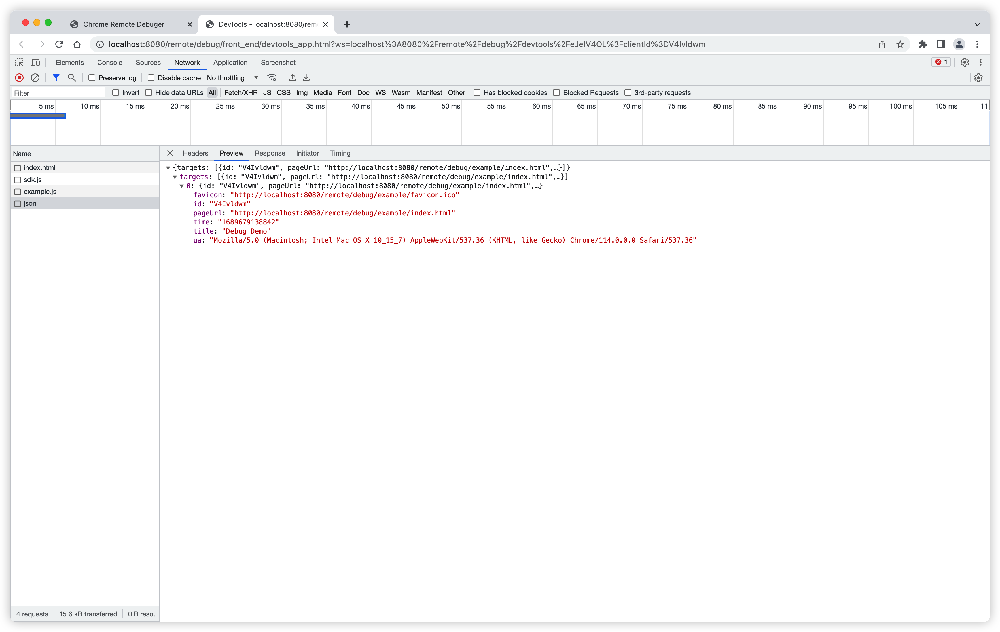
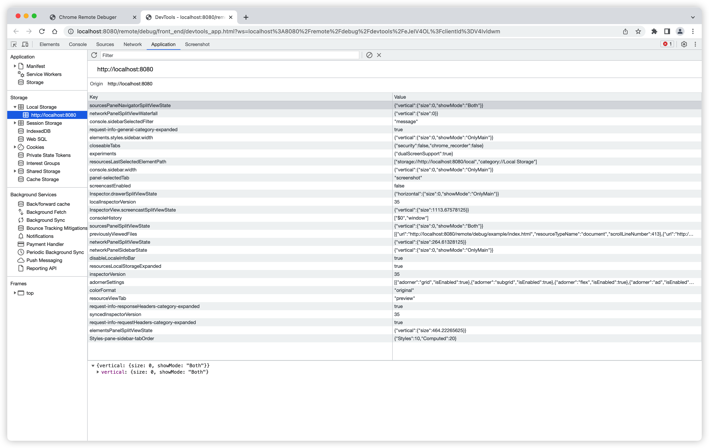
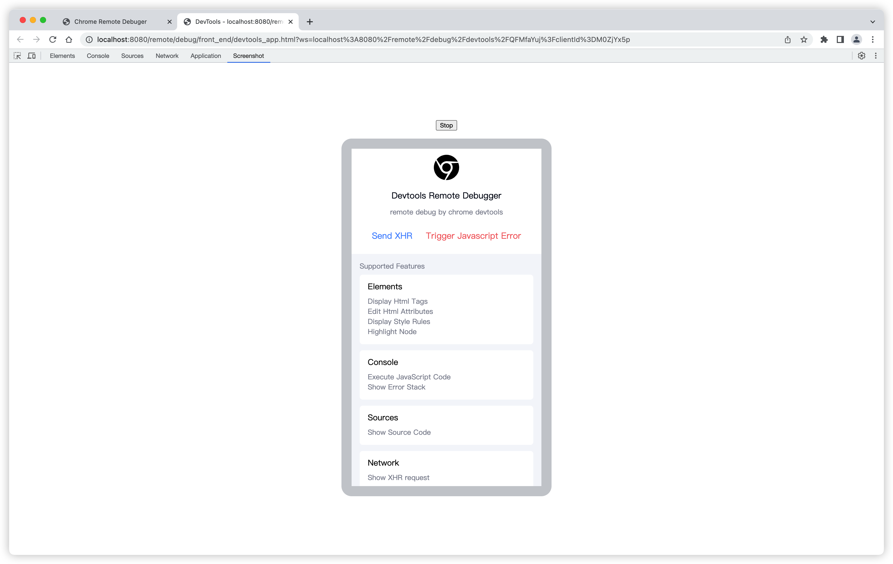

# Devtools Remote Debugger

[中文文档](./README_ZH.md)

Based on Google's open source [devtools-frontend](https://github.com/ChromeDevTools/devtools-frontend) developer tools, and implement the [Chrome DevTools Protocol](https://chromedevtools.github.io/devtools-protocol/) with JavaScript. You only need to load a js script in the web page to use the most familiar chrome devtools to remotely debug the page.

The web page being debugged is connected to the middle node layer through websocket, and devtools is also connected to node through websocket. The role of the node middle layer is mainly to forward the socket protocol to each other, so that the web page and devtools can realize full-duplex communication.


## Features:

### Elements
  - Display Html Tags
  - Edit Html Attributes
  - Display Style Rules
  - Highlight Node

<details>
  <summary>
    Preivew
  </summary>



</details>

### Console
  - Execute JavaScript Code
  - Show Error Stack

<details>
  <summary>
    Preivew
  </summary>


</details>


### Sources
  - Show Source Code

<details>
  <summary>
    Preivew
  </summary>



</details>

### Network
  - Show XHR request

<details>
  <summary>
    Preivew
  </summary>


</details>

### Application
  - Local storage
  - Session storage
  - Cookies

<details>
  <summary>
    Preivew
  </summary>


</details>

### Screenshot
  - Live Preview

<details>
  <summary>
    Preivew
  </summary>


</details>

## Debug DEMO

https://github.com/Nice-PLQ/devtools-remote-debugger/assets/10710341/93c5cbb4-c13d-4f93-866c-9b97ffc327e9


## How to start?

Open the command terminal and start the following two commands

### 1. Start Serve

```
// 1. Start the node service
npm run serve

// 2. Start a new terminal
npm run client
```

### 2. Open the debug page

Open two pages in the browser

- Debug DEMO page: [http://localhost:8080/remote/debug/example/index.html](http://localhost:8080/remote/debug/example/index.html)
- debug background: [http://localhost:8899/page/index.html](http://localhost:8899/page/index.html)


## How to use?

1、Modify the variables of the `.env` file

```sh
# The port number to start the Node, such as: port 80
DEBUG_PORT=8080
# Debug the domain name after the deployment of the backend, such as: https://www.remote-debug.com/
DEBUG_HOST='http://localhost:8080'
```

2. Execute `npm run build` to build the project code, and the `dist` directory will be packaged. The structure is as follows:

```
├── page    # Debug backend
│   ├── index.css
│   ├── index.html
│   ├── index.js
├── sdk.js  # The sdk code for debugging needs to load the script in the debugged page, and it can be deployed to cdn
```

3、Start the backend
```sh
npm run start
```

## Other instructions
Due to the restrictions of the same-origin policy, you may need to make the following changes:
- Browsers do not allow JavaScript to read CSSRules of different domains by default, so you need to add the `crossorigin="anonymous"` attribute when the link introduces an external style, and the style of the style tag does not have this problem.
- To capture Javascript specific error messages, you also need to add `crossorigin="anonymous"` to the script tag.
