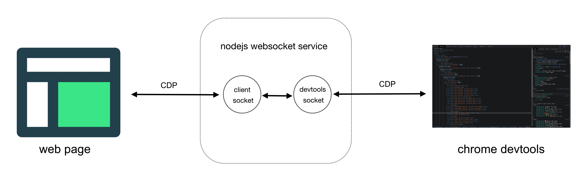
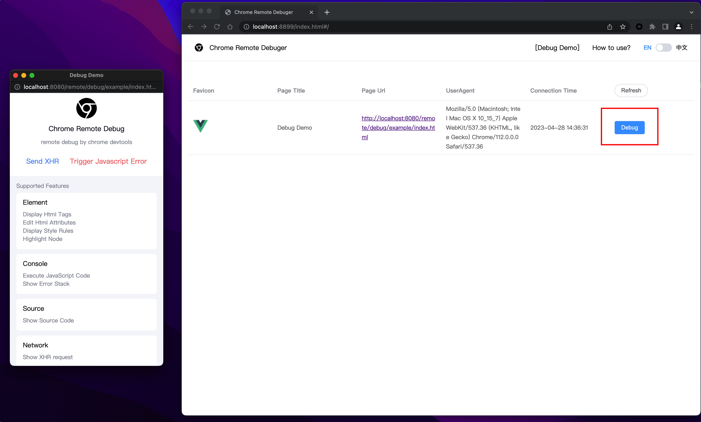

# Chrome Remote Debug

[中文文档](./README_ZH.md)

Based on Google's open source [devtools-frontend](https://github.com/ChromeDevTools/devtools-frontend) developer tools, and implement the [Chrome DevTools Protocol](https://chromedevtools.github.io/devtools-protocol/) with JavaScript. You only need to load a js script in the web page to use the most familiar chrome devtools to remotely debug the page.

The web page being debugged is connected to the middle node layer through websocket, and devtools is also connected to node through websocket. The role of the node middle layer is mainly to forward the socket protocol to each other, so that the web page and devtools can realize full-duplex communication.



## Features:

- Elements
  - Display Html Tags
  - Edit Html Attributes
  - Display Style Rules
  - Highlight Node

- Console
  - Execute JavaScript Code
  - Show Error Stack

- Sources
  - Show Source Code

- Network
  - Show XHR request

- Application
  - Local storage
  - Session storage
  - Cookies

- Screenshot
  - Live Preview

## Debug DEMO

https://github.com/Nice-PLQ/devtools-remote-debugger/assets/10710341/93c5cbb4-c13d-4f93-866c-9b97ffc327e9


## How to start?

Open the command terminal and start the following two commands

### 1. Start Serve

```
// 1. Start the node service
npm run serve

// 2. Start a new terminal
npm run client
```

### 2. Open the debug page

Open two pages in the browser

- Debug DEMO page: [http://localhost:8080/remote/debug/example/index.html](http://localhost:8080/remote/debug/example/index.html)
- debug background: [http://localhost:8899/page/index.html](http://localhost:8899/page/index.html)



## Deploy

Modify variables in the `.env` file
